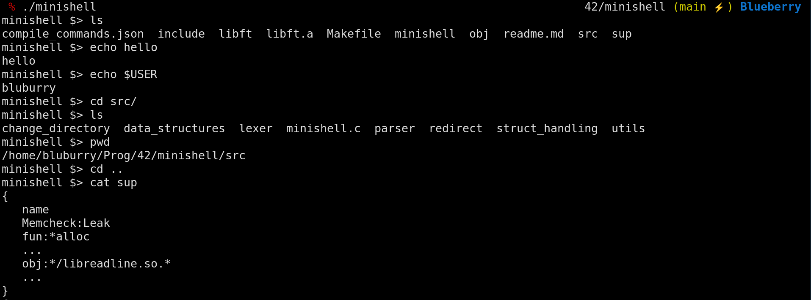

## Minishell 42 Project

A simplified shell created in C.

### Compilation and running

To run:

```bash
make
./minishell
```



To clean the files created:

```bash
make fclean
```

There is also a command to check for leaks

```bash
make leaks
```

The make command generates a suppression file so that valgrind ignores any leaks caused by readline, which was a requirement for this project
